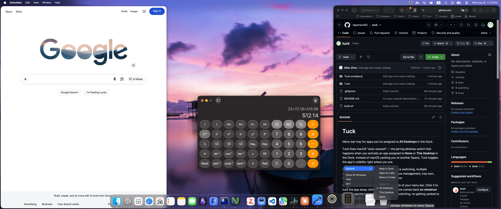

# Tuck

Menu-bar tray for apps you've assigned to **All Desktops** in the Dock.

Tuck fixes macOS "auto-swoosh" — the jarring desktop switch that happens when you
activate an app assigned to **None** or **This Desktop** in the Dock. Instead of
macOS yanking you to another Space, Tuck toggles the app's visibility right where
you are.

Keywords: auto-swoosh, all desktops, space switching, multiple desktops, menu bar utility, app hider, window management, tray icon, hide app, show app, macOS desktop, Spaces



Each such app gets an icon on the right side of your menu bar. Click it to tuck the
app away; click again and its window comes back **on whatever desktop you're currently
on** — no Space switching, no getting yanked to another desktop.

The trick: macOS already puts All-Desktops windows on every Space. Tuck doesn't move
anything. It only toggles visibility, which is entirely supported API.

## Build

Open `Tuck.xcodeproj` in Xcode and press **⌘R** to build and run. Or from the
command line:

```
xcodebuild -project Tuck.xcodeproj -scheme Tuck -configuration Release build
open build/Release/Tuck.app
```

Alternatively, a shell build script is included:

```
chmod +x build.sh
./build.sh install
```

## Setup

1. Right-click an app's Dock icon → **Options** → **Assign To** → **All Desktops**.
2. Its icon appears in your menu bar within ~3 seconds.

That's the whole configuration. The Dock *is* the settings UI — Tuck just reads
`com.apple.spaces` → `app-bindings` to see which apps are set to `AllSpaces`.

To stop managing an app, set its Dock assignment back to **None**.

## Use

| Action | Result |
| --- | --- |
| Click an icon | Tuck the app away, or bring it back to this desktop |
| Right-click (or ctrl-click) an icon | Menu: Show/Tuck, Tuck All Away, Auto-tuck, Refresh, Quit |
| Dimmed icon | That app is currently tucked away |

**Auto-tuck when app loses focus** (off by default) makes it behave like a real tray:
the app hides itself the moment you click elsewhere. Turn it on from the right-click
menu if you want that; it's off initially because it can be startling.

## Permissions

The core needs **none**. Hiding, showing, activating, and reading the Dock assignment
are all public API with no TCC prompt.

One optional step needs Accessibility: if you click an icon for an app that is running
with *zero* windows open, Tuck tries File → New Window (falling back to ⌘N) so you get
something to look at. Without Accessibility permission it silently skips this and just
activates the app. Grant it in **System Settings → Privacy & Security → Accessibility**
if you want that behavior.

## Known limitations (MVP)

- **Hiding is per-app, not per-window.** ⌘H hides everything the app has open. If an
  app has windows you wanted left alone, they go too.
- **Menu bar space is finite.** One icon per app. On a notched MacBook Pro, icons that
  overflow past the notch don't render at all — three or four managed apps is a
  comfortable ceiling.
- **The Dock tile stays.** You can't strip another app's Dock presence, so a managed app
  shows up in both the Dock and the menu bar.
- **Still in ⌘-Tab.** A tucked app remains in the app switcher and Mission Control.
  Removing it from there needs private APIs; not worth it.
- **Full-screen apps are out of scope** — macOS won't let them be assigned to All
  Desktops in the first place.
- **Finder** resists `hide()` and behaves oddly if managed.
- The app list refreshes on a 3-second poll. Assign an app in the Dock and wait a beat.

## If no icons appear

Check that the assignment is actually being recorded:

```
defaults read com.apple.spaces app-bindings
```

You should see your app's bundle identifier mapped to `AllSpaces`. If the key is missing
or the value looks different on your macOS version, that's the detection path failing —
the fix is to switch Tuck to its own app list instead of reading the Dock setting.
